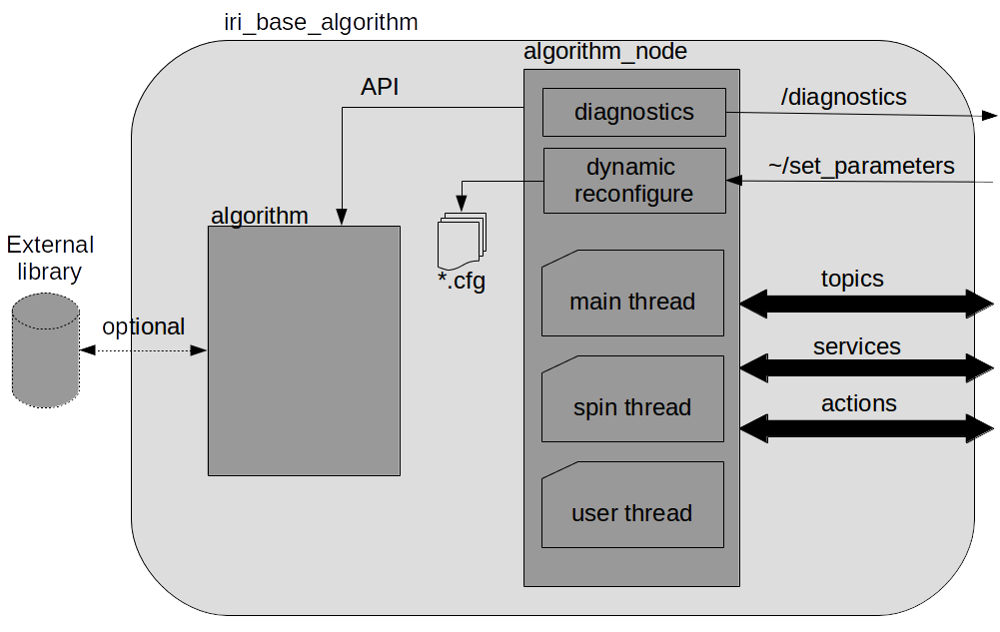

# Description
This project is intended to be used as a base class for ROS nodes that have to implement an algorithm. The next diagram shows the basic structure of the IRI ROS base algorithm node:

The structure of this node is mainly the same as the [iri_base_driver](https://gitlab.iri.upc.edu/labrobotica/ros/iri_core/iri_base_driver) nodes, with the exception of the state machine used to handle the operation of the low level driver.

This node is structured into two parts, both implemented as C++ classes:

## Algorithm
This part is intended for the implementation of the algorithm itself. The use of an external library to implement the algorithm is strongly recommended to separate the algorithm functionality from the ROS middleware. However it is also possible to implement the algorithm here. 

The algorithm part provides a mutex to protect the access to critical information. This mutex can be used internally by the algorithm functions and also by the algorithm node through a set of public functions of the algorithm class (lock(), unlock() and try_enter()). Make sure the mutex is left unlocked after use to avoid blocking the normal operation of the node.

## Algorithm node
This part is intended for the implementation of the ROS interfaces (topics, services and actions) and other ROS tools. It has an object of the algorithm class to have full access to the algorithm functionalities. The main features of this part are listed next, and a detailed description can be found below.

* Independent thread with configurable rate.
* Dynamic reconfigure server.
* Diagnostics publisher.
* Public and private ROS node handlers.

Detailed features description

### Threads
The algorithm node provides three separate threads:

* The spin thread is used to call the ROS spin() function. The single threaded version of this function is used, so that all callbacks are executed, sequentially, in the same thread.
* The user thread is used to provide the ability to execute code in parallel and avoid blocking the callback functions. This thread is handled internally when the class is created and destroyed and a single function is provided to the user (mainNodeThread) which is called at a desired rate. The thread rate can be handled with the *setRate()* and *getRate()* functions. 
* The main thread is used to publish the node diagnostics data.

### Dynamic reconfigure
A dynamic reconfigure server is initialized by default. It has an associated .cfg file located in the *cfg* folder where the user can define all the parameters that can be updated at run-time. Whenever a parameter value is changed (using the [rqt_reconfigure](http://wiki.ros.org/rqt_reconfigure)) application) two callback functions are called:

* reconfigure callback at the algorithm part (config_update).
* reconfigure callback at the algorithm node part (node_config_update)

Each callback receives the whole dynamic reconfigure data structure, but should only use its associated parameters.

All node parameters can be defined this way, but it is recommended to only use it for run-time dynamic parameters.

### Diagnostic publisher
A diagnostic publisher is also initialized by default. It provides the ability to collect status data from the algorithm and the algorithm node, and publishes it. The [rqt_runtime_monitor](http://wiki.ros.org/rqt_runtime_monitor) application can be used to monitor the diagnostics.

By default no diagnostic data is published. Diagnostics can be added at star-up by the user with the addNodeDiagnostics() function which can be implemented in the inherited class. For further information on ROS diagnostics feature go [here](http://wiki.ros.org/diagnostics).

### ROS node Handlers
The algorithm node provides two separate ROS NodeHandlers:

* the public node handle is initialized by a node handle provided to the constructor of the algorithm node. If no node handle is defined, "/" will be used.
* the private node handle is initialized to "~" by default.

These node handlers can be used to get/set ROS parameters and to set-up ROS interfaces. Depending on the node handle used, the namespace of the corresponding parameter or interface will be different.

# ROS Interface

### Service servers
- *~/set_parameters* ([dynamic_reconfigure/Reconfigure.srv](http://docs.ros.org/melodic/api/dynamic_reconfigure/html/srv/Reconfigure.html)):
    Service to dynamically change the parameters of the node. Only the parameters defined in the .cfg file can be modified this way. 

### topic publishers
- */diagnostics* ([diagnostic_msgs/DiagnosticArray](http://docs.ros.org/api/diagnostic_msgs/html/msg/DiagnosticArray.html)):
   Topic with all the diagnostics published by the node.

### Parameters
- **rate** *(double; Default: 10.0; Max: 1000.0; Min: 0.1)*:
    The rate of execution of the user thread in Hz.

# Dependencies
This base node has no dependencies.

# How to use it

This ROS node is not designed to be used on its own, an inherited class is always required. 

To simplify the process of inheriting from this class, there is an script (*create_algorithm_package*) which creates a ROS algorithm package using this node as a base class. 

Also, there exist other scripts to easily add ROS interfaces (topic publishers or subscribers, service servers or clients and action servers or clients) and also TF listener or broadcaster.

Check the [IRI ROS scripts](https://gitlab.iri.upc.edu/labrobotica/ros/iri_core/iri_ros_scripts) page for further information on all these scripts.

## Disclaimer

Copyright (C) Institut de Robòtica i Informàtica Industrial, CSIC-UPC.
Mantainer IRI labrobotics (labrobotica@iri.upc.edu)

This package is distributed in the hope that it will be useful, but without any warranty. It is provided "as is" without warranty of any kind, either expressed or implied, including, but not limited to, the implied warranties of merchantability and fitness for a particular purpose. The entire risk as to the quality and performance of the program is with you. should the program prove defective, the GMR group does not assume the cost of any necessary servicing, repair  or correction.

In no event unless required by applicable law the author will be liable to you for damages, including any general, special, incidental or consequential damages arising out of the use or inability to use the program (including but not limited to loss of data or data being rendered inaccurate or losses sustained by you or third parties or a failure of the program to operate with any other programs), even if the author has been advised of the possibility of such damages.

You should have received a copy of the GNU Lesser General Public License
along with this program.  If not, see <http://www.gnu.org/licenses/>

