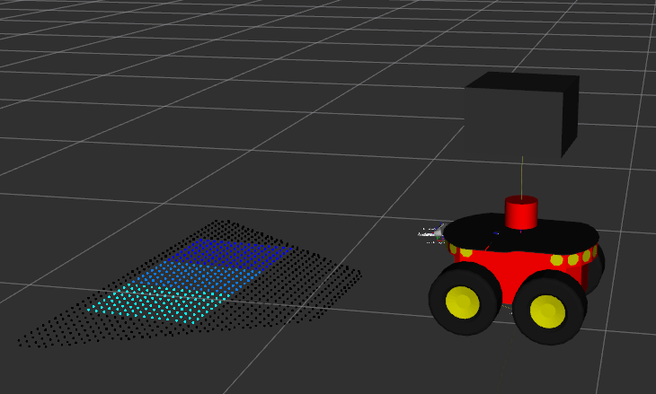
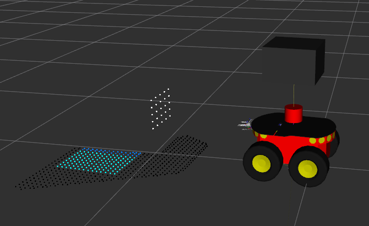

## Description

ROS package to detect possible obstacles below the ground level (holes) using a pointcloud. This node performs the following actions:

* Works on a limited 3D region of the input pointcloud. The size of this region can be configured.
* This region is divided by a configurable number of zones. Each zone appears in a different color in the output pointcloud.
* Depending on the number of points on each zone:
    * If the number of points is below a given threshold, the zone is considered to be non traversable, and an artificial pointcloud is generated with several points at the beginning of the corresponding zone. This pointcloud can be used as a source in a costmap layer to mark occupied cells in the costmap (both local and global).
    * If the number of points is above a given threshold, the zone is considered to be traversable. This pointcloud can be used as a source in a costmap layer clear any previous costmap cells in a costmap (both local and global).

The next image shows the 3 different regions used for hole detection when there is no hole close to the robot:



The next image shows the artificial pointcloud generated to indicate the presence of a hole close to the robot (the farthest region has no points):



This ROS node is intended to be used with pointclouds generated by depth cameras because they have a higher point density that the ones generated by 3D LIDAR sensors.

This packages provides a regular node and a [nodelet](http://wiki.ros.org/nodelet) that can be used with a nodelet_manager to group together several packages handling point cloud data.

The implementation of this node is base on the following papers:

* Àngel Santamaria-Navarro, Ernesto H. Teniente, Martí  Morta and Juan Andrade-Cetto - [Initial work for PMD camera]()

* Àngel Santamaria-Navarro, Ernesto H. Teniente, Martí Morta and Juan Andrade-Cetto - [Terrain classification in complex 3D outdoor environments](https://upcommons.upc.edu/bitstream/handle/2117/27991/1496-Terrain-classification-in-complex-3D-outdoor-environments.pdf?sequence=1&isAllowed=y)

## ROS Interfaces

### Topic subscribers

* **input**<sensor_msgs::PointCloud2> - Input pointcloud.

### Topic publishers

* **hole_zone**<sensor_msgs::PointCloud2> - The same input pointcloud with the zones of interest marked in different colors. This topic is intended for debugging.
* **hole_obstacle**<sensor_msgs::PointCloud2> - An artificial pointcloud with several points placed at the beginning of the zones that don't have enough points.

### Parameters

* **hole_min_p** (default=30) - Threshold of points to consider that there is a hole in a specific zone (less points is a hole).
* **num_cells** (default=3) - Number of zones in the detection region.
* **box_y** (default=0.6) - Size of the hole detection region in the Y direction with respect to to the base_link frame of the robot in meters.
* **box_x_ini** - Start position of hole detection region in the X direction with respect to to the base_link frame of the robot in meters.
* **box_x_end** - Start position of hole detection region in the X direction with respect to to the base_link frame of the robot in meters.
* **box_z_ini** - Maximum height of the hole detection region with respect to to the base_link frame of the robot in meters.
* **box_z_end** - Minimum height of the hole detection region with respect to to the base_link frame of the robot in meters.

## Dependencies
This package requires the following packages:

* [iri_base_algorithm](https://gitlab.iri.upc.edu/labrobotica/ros/iri_core/iri_base_algorithm): 

### Installing

Move to the active workspace:
```bash
roscd && cd ../src
```

Clone the repository: 
```bash
git clone ssh://git@gitlab.iri.upc.edu:2202/labrobotica/ros/navigation/3d_navigation/iri_point_cloud_hole_detection.git
```

Install ROS dependencies:
```
roscd
cd ..
rosdep install -i -r --from-paths src
```

Compile the workspace:
```
catkin_make
```

## Launch

This package is normally launched as part of a more complete launch file, either in simulation or with the real robot.

The main node launch file (*node.launch*) has the following arguments:

* **ns** (default=robot): namespace in which to include the node.
* **node_name** (default=model_car_odometry): name of the ROS node.
* **output** (default=screen): Desired log output. Possible values are screen and log.
* **launch_prefix** (default=): Set of parameters to be pre-apended to the node launch command.
* **config_file** (default=$(find iri_point_cloud_hole_detection)/config/ana_params.yaml): file with the definition of the angular sections to eliminate.
* **cloud_in** (default=/encoders): Name of the input PointCloud topic.

The main nodelet launch file (*nodelet.launch*) has the following arguments:

* **ns** (default=robot): namespace in which to include the node.
* **node_name** (default=model_car_odometry): name of the ROS node.
* **output** (default=screen): Desired log output. Possible values are screen and log.
* **camera_nodelet_manager** (default=camera_nodelet_manager): Name of the nodelet manager in which this nodelet will be included.
* **config_file** (default=$(find iri_point_cloud_hole_detection)/config/ana_params.yaml): file with the definition of the angular sections to eliminate.
* **cloud_in** (default=/encoders): Name of the input PointCloud topic.

To include the iri_obstacle_detection_normals as a node into another launch file, include the following lines:

```
  <include file="$(find iri_point_cloud_hole_detection)/launch/node.launch">
    <arg name="ns" value="$(arg ns)"/>
    <arg name="node_name" value="$(arg near_hole_detection_node_name)"/>
    <arg name="config_file" value="$(arg near_hole_detection_config_file)"/>
    <arg name="output" value="$(arg output)"/>
    <arg name="launch_prefix" default="$(arg launch_prefix)"/>
    <arg name="cloud_in" default="$(arg hole_detection_cloud_in)"/>
  </include>
```

To include the iri_obstacle_detection_normals as a nodelet into another launch file, include the following lines:

```
  <group ns="$(arg ns)">
    <node name="$(arg camera_nodelet_manager)"
          pkg="nodelet"
          type="nodelet"
          args="manager"
          output="screen"/>
  </group>

  <include file="$(find iri_point_cloud_hole_detection)/launch/nodelet.launch">
         <arg name="ns" value="$(arg ns)"/>
         <arg name="node_name" value="$(arg far_hole_detection_node_name)"/>
         <arg name="camera_nodelet_manager" value="$(arg hole_nodelet_manager)"/>
         <arg name="config_file" value="$(arg far_hole_detection_config_file)"/>
         <arg name="output" value="$(arg output)"/>
         <arg name="launch_prefix" default="$(arg launch_prefix)"/>
         <arg name="cloud_in" default="$(arg hole_detection_cloud_in)"/>
  </include>
```

A single nodelet_manager is required for all nodelets handling the same input data.

## Disclaimer

Copyright (C) Institut de Robòtica i Informàtica Industrial, CSIC-UPC.
Mantainer IRI labrobotics (labrobotica@iri.upc.edu)

This package is distributed in the hope that it will be useful, but without any warranty. It is provided "as is" without warranty of any kind, either expressed or implied, including, but not limited to, the implied warranties of merchantability and fitness for a particular purpose. The entire risk as to the quality and performance of the program is with you. should the program prove defective, the GMR group does not assume the cost of any necessary servicing, repair  or correction.

In no event unless required by applicable law the author will be liable to you for damages, including any general, special, incidental or consequential damages arising out of the use or inability to use the program (including but not limited to loss of data or data being rendered inaccurate or losses sustained by you or third parties or a failure of the program to operate with any other programs), even if the author has been advised of the possibility of such damages.

You should have received a copy of the GNU Lesser General Public License along with this program. If not, see <http://www.gnu.org/licenses/>
